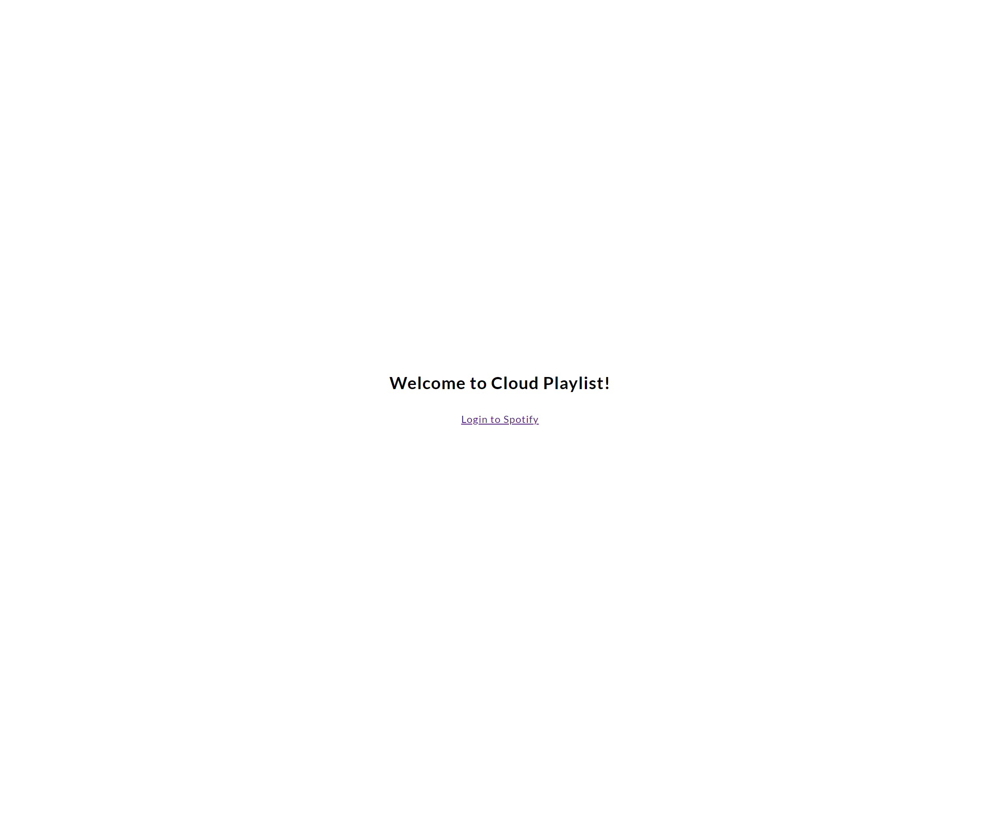
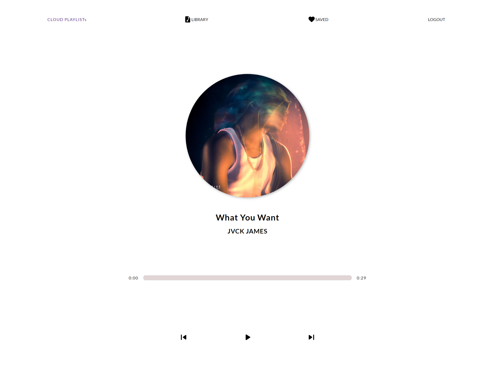
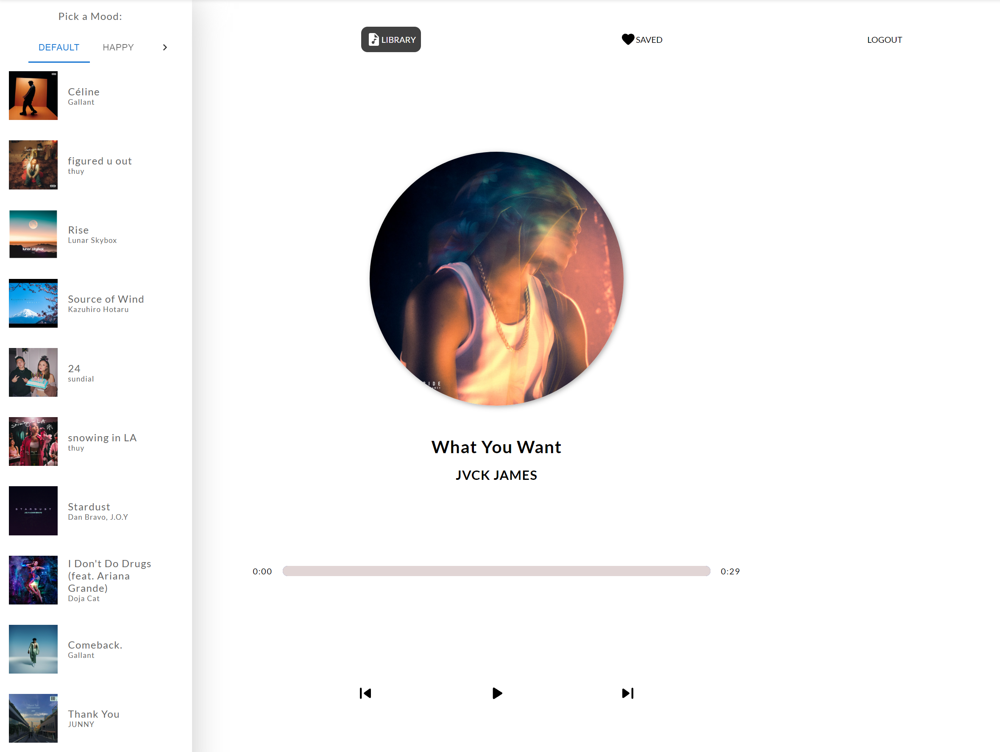
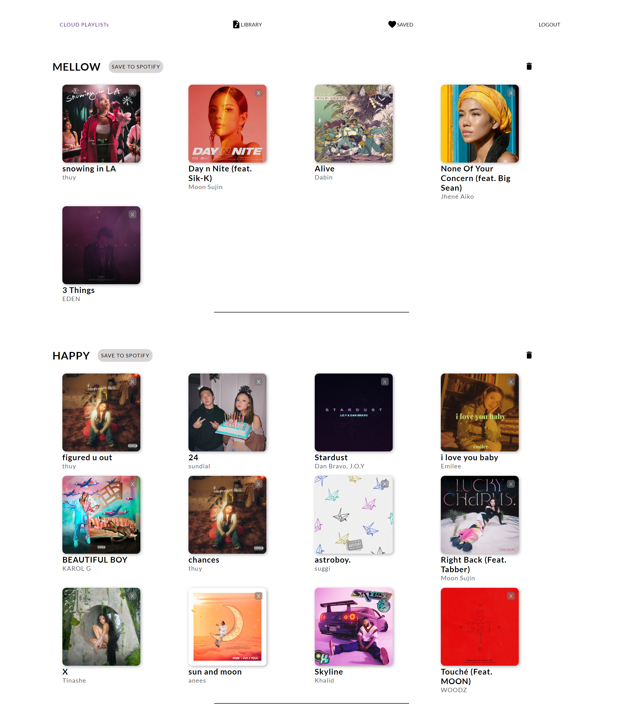

# Cloud Playlist

This project was bootstrapped with [Create React App](https://github.com/facebook/create-react-app).

### `Tech Stack Used`

- MongoDB
- Express
- React
- Node.js
- Axios
- HTTP
- REST API

## What does it do?

Normally, Spotify is able to filter your likes by genres or mood but only on the mobile app, not on your desktop, AND it doesn't let you add those filtered likes as a playlist automatically.

THIS is an app that allows users to automatically generate filtered playlists by moood based on the users' likes list on Spotify!

Authentication is done through Spotify User Authorization.

Once authenticated, the users' likes will be categorized into 5 different moods.

Users are able to save the mood playlists on the app, and edit it by deleting the playlist itself, or specific tracks.

Finally, the user may save the preferred playlist to Spotify App themselves, where they can edit the playlist name, description, etc.

### `Login Page`

### `Home Page`

### `Library Page`

### `Saved Page`

**Shoutout to my instructors, and fellow Concordia University classmates!**
